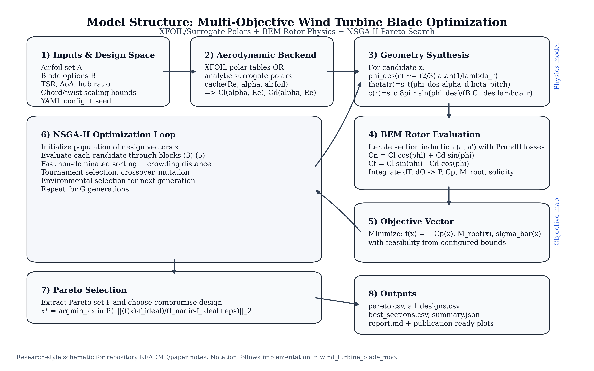
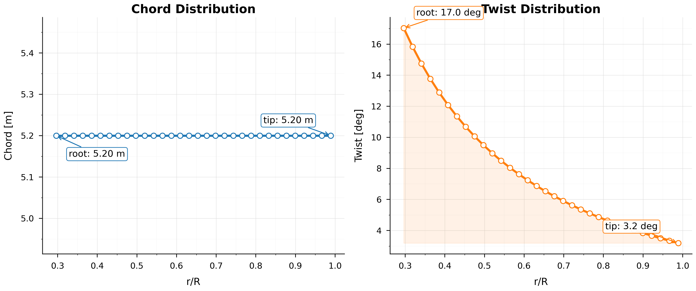
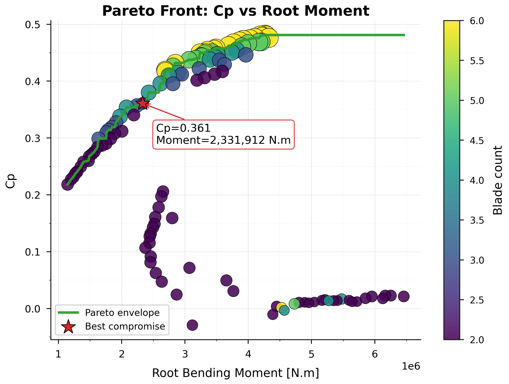
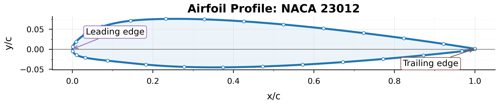

# Turbine Blade Multi-Objective Optimization

*Li et al. (2023)-inspired computational framework for aerodynamic design*

This repository presents a wind turbine blade optimization framework grounded in the formulation of blade design as a dynamic, multi-objective problem. Rather than seeking a single optimum, the system constructs Pareto-optimal solutions across competing aerodynamic and structural criteria.

The implementation integrates airfoil polar evaluation (XFOIL or surrogate-based), rotor-scale performance modeling via Blade Element Momentum (BEM) theory, and population-based multi-objective optimization (NSGA-II style). The resulting pipeline enables systematic exploration of the coupled geometry–performance design space.

---

## Problem Formulation

Blade design is expressed as a structured decision vector spanning airfoil selection, blade count, tip-speed ratio, angle of attack, hub ratio, and chord/twist scaling.

System performance is evaluated through competing objectives, including power coefficient (`Cp`), root bending moment, and rotor solidity. Optimization proceeds by iteratively sampling this space and extracting the Pareto front, thereby exposing the trade structure governing feasible designs.

---

## Mathematical Formulation

Let the design vector be

$$
\mathbf{x} = \left(i_{af}, B, \lambda, \alpha_d, r_h, s_c, s_t \right),
$$

where `i_af` is airfoil index, `B` is blade count, `\lambda` is tip-speed ratio, `\alpha_d` is design angle of attack, `r_h` is hub-radius ratio, and `s_c, s_t` are chord/twist scaling factors.

The implemented multi-objective problem is solved in minimization form:

$$
\min_{\mathbf{x}} \ \mathbf{f}(\mathbf{x}) =
\left[
-C_p(\mathbf{x}), \ M_{\text{root}}(\mathbf{x}), \ \bar{\sigma}(\mathbf{x})
\right]
$$

subject to the bounds and discrete sets defined in YAML config files:

$$
\lambda \in [\lambda_{\min}, \lambda_{\max}], \quad
\alpha_d \in [\alpha_{\min}, \alpha_{\max}], \quad
r_h \in [r_{h,\min}, r_{h,\max}],
$$
$$
s_c \in [s_{c,\min}, s_{c,\max}], \quad
s_t \in [s_{t,\min}, s_{t,\max}], \quad
B \in \mathcal{B}, \quad
i_{af} \in \mathcal{A}.
$$

### BEM Governing Relations

Rotor and section-level quantities follow standard BEM relations used in the implementation:

$$
\lambda = \frac{\Omega R}{V_\infty}, \quad
\phi = \tan^{-1}\left(\frac{1-a}{\lambda_r(1+a')}\right), \quad
\alpha = \phi - (\theta + \beta_{pitch})
$$

$$
C_n = C_l \cos\phi + C_d \sin\phi, \quad
C_t = C_l \sin\phi - C_d \cos\phi
$$

$$
a = \frac{1}{\frac{4F\sin^2\phi}{\sigma C_n}+1}, \quad
a' = \frac{1}{\frac{4F\sin\phi\cos\phi}{\sigma C_t}-1}
$$

$$
dT = \frac{1}{2}\rho W^2 B c C_n \, dr, \quad
dQ = \frac{1}{2}\rho W^2 B c C_t r \, dr
$$

$$
P=\Omega \int dQ, \quad
C_p = \frac{P}{\frac{1}{2}\rho A V_\infty^3}
$$

Geometry initialization for each section uses

$$
\phi_{des}(r) \approx \frac{2}{3}\tan^{-1}\left(\frac{1}{\lambda_r}\right), \quad
\theta(r)= s_t\left(\phi_{des}(r)-\alpha_d-\beta_{pitch}\right),
$$
$$
c(r)= s_c \cdot \frac{8\pi r\sin(\phi_{des})}{B C_{l,des}\lambda_r}.
$$

### Pareto Selection and Compromise Point

NSGA-II style non-dominated sorting and crowding distance are used to build a Pareto set. A single recommended design is then selected by minimum normalized distance to the ideal point:

$$
\mathbf{z}(\mathbf{x}) = \frac{\mathbf{f}(\mathbf{x})-\mathbf{f}_{ideal}}
{\mathbf{f}_{nadir}-\mathbf{f}_{ideal}+\epsilon}, \quad
\mathbf{x}^* = \arg\min_{\mathbf{x}\in\mathcal{P}} \|\mathbf{z}(\mathbf{x})\|_2.
$$

---

## Methodological Positioning

This work follows the conceptual framework of Li et al. (2023), which characterizes turbine blade optimization as multi-objective, sequential in its treatment of design variables, and constrained by the cost of aerodynamic evaluation.

The present implementation preserves this structure while introducing practical substitutions: evolutionary search in place of reinforcement learning, BEM in place of full CFD cascade evaluation, and analytic surrogate polars in place of learned CFD surrogates. These choices prioritize reproducibility and computational efficiency while maintaining the underlying optimization logic.

---

## Computational Structure

The pipeline consists of four coupled components:

1. Aerodynamic modeling via cached XFOIL or surrogate polars
2. Rotor analysis using iterative BEM evaluation
3. Multi-objective optimization via non-dominated sorting and crowding distance
4. Post-processing including Pareto extraction, compromise selection, and sensitivity analysis

---

## Model Structure Diagram



---

## Actual Plot Results

The figures below are generated outputs from an actual high-accuracy run in this repository (`outputs_high_accuracy/`, XFOIL backend):

- Best compromise design: `NACA 23012`, `B=2`, `Cp=0.3608`, `M_root=2.33e6 N.m`

**1) Chord and twist distributions (best compromise design)**



**2) Pareto front (`Cp` vs root bending moment)**



**3) Selected airfoil profile geometry**



---

## Usage

The framework is exposed both as a command-line workflow and a Python API.

**CLI execution**

```bash
python -m pip install -e .
python -m wind_turbine_blade_moo --config configs/quick_test.yaml
wtb-moo --config configs/quick_test.yaml
```

**Python API**

```python
from wind_turbine_blade_moo.config import load_config
from wind_turbine_blade_moo.pipeline import run_pipeline

cfg = load_config("configs/quick_test.yaml")
summary = run_pipeline(cfg)

print(summary["cp"], summary["aero_backend"])
```

Execution produces a full design population, the Pareto-optimal subset, and a selected compromise solution with associated geometry and performance metrics.

---

## Interpretation

This repository should be read as a computational instantiation of a broader methodological claim: that wind turbine blade design is fundamentally a Pareto-structured, dynamically reconfigurable problem.

Accordingly, the system emphasizes explicit tradeoff representation, rapid re-optimization under varying constraints, and separation between model fidelity and optimization logic.

---

## References

[1] Lele Li, Weihao Zhang, Ya Li, Chiju Jiang, and Yufan Wang, "Multi-objective optimization of turbine blade profiles based on multi-agent reinforcement learning," *Energy Conversion and Management* 297 (2023): 117637. https://doi.org/10.1016/j.enconman.2023.117637
